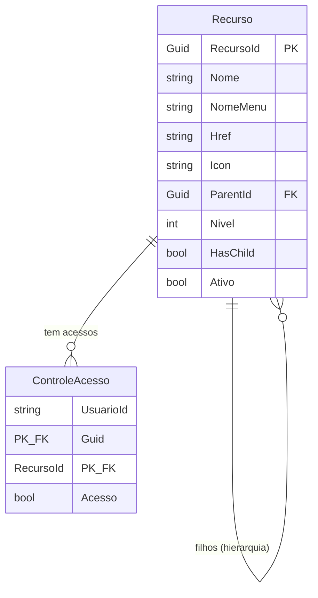

# 🔒 Análise de Camadas de Segurança — FrotiX

Análise completa de todas as camadas de segurança implementadas no projeto FrotiX, para servir de referência ao novo projeto.

---

## Visão Geral — Diagrama de Camadas

```mermaid
flowchart TB
    subgraph TRANSPORTE["🔐 1. Transporte"]
        HTTPS["HTTPS Redirection"]
        HSTS["HSTS (produção)"]
    end

    subgraph AUTH["👤 2. Autenticação"]
        IDENTITY["ASP.NET Identity"]
        COOKIE["Cookie Auth configurado"]
        LOGIN["Login customizado"]
    end

    subgraph AUTHZ["🛡️ 3. Autorização"]
        GLOBAL_FILTER["Filtro Global: RequireAuthenticatedUser"]
        ROLES["Sistema de Roles (Identity)"]
        RECURSO["Controle de Acesso granular (Recurso + ControleAcesso)"]
        MENU["Menu dinâmico por Role"]
    end

    subgraph CSRF["🔄 4. Proteção CSRF"]
        ANTIFORGERY["Antiforgery Token (X-CSRF-TOKEN)"]
    end

    subgraph SESSION["⏱️ 5. Sessão"]
        SESS_CONFIG["Session HttpOnly + IsEssential"]
        COOKIE_POLICY["Cookie Policy SameSite"]
    end

    subgraph ERRORS["🚨 6. Tratamento de Erros"]
        MIDDLEWARE_ERR["ErrorLoggingMiddleware"]
        MIDDLEWARE_UI["UiExceptionMiddleware"]
        FILTER_GLOBAL["GlobalExceptionFilter + AsyncExceptionFilter"]
        FILTER_PAGE["PageExceptionFilter + AsyncPageExceptionFilter"]
        TRYCATCH["Try-Catch obrigatório em TODAS as funções"]
        PROGRAM_EX["Global Exception Handlers (Program.cs)"]
    end

    subgraph LOG["📋 7. Logging"]
        LOG_SERVICE["ILogService (Singleton)"]
        LOG_PROVIDER["FrotiXLoggerProvider (custom)"]
        LOG_FILE["Log de emergência em arquivo"]
    end

    TRANSPORTE --> AUTH --> AUTHZ --> CSRF --> SESSION --> ERRORS --> LOG
```



---

## 1. 🔐 Segurança de Transporte (HTTPS + HSTS)

**Arquivos:** [Startup.cs](file:///Users/pablotrajano/Desktop/DevFrotix/SolucaoFrotiX/FrotiX.Site/Startup.cs#L467-L419)

| Mecanismo | Descrição |
|-----------|-----------|
| `UseHttpsRedirection()` | Redireciona todo tráfego HTTP → HTTPS |
| `UseHsts()` | Em produção, ativa HTTP Strict Transport Security |
| `UseResponseCompression()` | Compressão Brotli + Gzip habilitada para HTTPS |

```csharp
// Startup.cs → Configure()
if (env.IsDevelopment())
    app.UseDeveloperExceptionPage();
else
{
    app.UseExceptionHandler("/Error");
    app.UseHsts();  // ← HSTS apenas em produção
}

app.UseHttpsRedirection();
```

> [!IMPORTANT]
> Em produção, `UseDeveloperExceptionPage()` é **desabilitado**, evitando vazamento de stack traces para o usuário.

---

## 2. 👤 Autenticação (ASP.NET Identity)

**Arquivos:** [Startup.cs](file:///Users/pablotrajano/Desktop/DevFrotix/SolucaoFrotiX/FrotiX.Site/Startup.cs#L230-L254), [ApplicationDbContext.cs](file:///Users/pablotrajano/Desktop/DevFrotix/SolucaoFrotiX/FrotiX.Site/Data/ApplicationDbContext.cs)

### 2.1 Configuração do Identity

```csharp
services
    .AddIdentity<IdentityUser, IdentityRole>(options =>
        options.SignIn.RequireConfirmedAccount = false
    )
    .AddRoleManager<RoleManager<IdentityRole>>()
    .AddEntityFrameworkStores<ApplicationDbContext>();
```

### 2.2 Política de Senhas

```csharp
services.Configure<IdentityOptions>(opts =>
{
    opts.Password.RequireNonAlphanumeric = false;
    opts.Password.RequireLowercase = false;
    opts.Password.RequireUppercase = false;
    opts.Password.RequireDigit = false;
});
```

> [!WARNING]
> A política de senhas está **relaxada** — sem requisitos de complexidade. Para o novo projeto, considere exigir pelo menos comprimento mínimo e caracteres especiais.

### 2.3 Configuração de Cookie de Autenticação

```csharp
services.ConfigureApplicationCookie(options =>
{
    options.Cookie.Name = "FrotiX";
    options.LoginPath = "/Identity/Account/LoginFrotiX";
    options.LogoutPath = "/Identity/Account/Logout";
    options.AccessDeniedPath = "/Identity/Account/AccessDenied";
    options.ExpireTimeSpan = TimeSpan.FromHours(10);
    options.SlidingExpiration = true;
});
```

| Atributo | Valor | Significado |
|----------|-------|-------------|
| `Cookie.Name` | `"FrotiX"` | Nome customizado do cookie |
| `LoginPath` | `/Identity/Account/LoginFrotiX` | Página de login customizada |
| `AccessDeniedPath` | `/Identity/Account/AccessDenied` | Página de acesso negado |
| `ExpireTimeSpan` | 10 horas | Tempo de expiração da sessão |
| `SlidingExpiration` | `true` | Renova expiração a cada request |

---

## 3. 🛡️ Autorização (3 camadas)

### 3.1 Filtro Global de Autorização

**Arquivo:** [Startup.cs](file:///Users/pablotrajano/Desktop/DevFrotix/SolucaoFrotiX/FrotiX.Site/Startup.cs#L258-L269)

**Toda a aplicação exige autenticação por padrão.** Nenhuma página é acessível sem login, exceto se explicitamente marcada com `[AllowAnonymous]`.

```csharp
services.AddControllersWithViews(options =>
{
    var policy = new AuthorizationPolicyBuilder()
        .RequireAuthenticatedUser()
        .Build();
    options.Filters.Add(new AuthorizeFilter(policy));
});
```

### 3.2 Sistema de Roles (Identity)

**Arquivos:** [Roles.cshtml.cs](file:///Users/pablotrajano/Desktop/DevFrotix/SolucaoFrotiX/FrotiX.Site/Areas/Authorization/Pages/Roles.cshtml.cs), [Users.cshtml.cs](file:///Users/pablotrajano/Desktop/DevFrotix/SolucaoFrotiX/FrotiX.Site/Areas/Authorization/Pages/Users.cshtml.cs)

- Gestão de **Roles** via área `/Authorization/Roles`
- Gestão de **Usuários** via área `/Authorization/Users`
- Ambas protegidas com `[Authorize]`

### 3.3 Controle de Acesso Granular (Recurso + ControleAcesso)

**Arquivos:** [Recurso.cs](file:///Users/pablotrajano/Desktop/DevFrotix/SolucaoFrotiX/FrotiX.Site/Models/Cadastros/Recurso.cs), [ControleAcesso.cs](file:///Users/pablotrajano/Desktop/DevFrotix/SolucaoFrotiX/FrotiX.Site/Models/Cadastros/ControleAcesso.cs), [ControleAcessoDbContext.cs](file:///Users/pablotrajano/Desktop/DevFrotix/SolucaoFrotiX/FrotiX.Site/Data/ControleAcessoDbContext.cs)

Sistema de **ACL (Access Control List)** com tabelas hierárquicas:



### 3.4 Menu Dinâmico Baseado em Role

**Arquivo:** [IdentityExtensions.cs](file:///Users/pablotrajano/Desktop/DevFrotix/SolucaoFrotiX/FrotiX.Site/Extensions/IdentityExtensions.cs#L27-L28)

```csharp
public static IEnumerable<ListItem> AuthorizeFor(
    this IEnumerable<ListItem> source, ClaimsPrincipal identity)
    => source.Where(x => x.Roles.IsNullOrEmpty() || 
       (x.Roles.HasItems() && identity.HasRole(x.Roles)));
```

O menu de navegação filtra itens **automaticamente** com base nas roles do usuário logado.

---

## 4. 🔄 Proteção CSRF (Antiforgery)

**Arquivo:** [Startup.cs](file:///Users/pablotrajano/Desktop/DevFrotix/SolucaoFrotiX/FrotiX.Site/Startup.cs#L302)

```csharp
services.AddAntiforgery(o => o.HeaderName = "X-CSRF-TOKEN");
```

Protege contra ataques Cross-Site Request Forgery via header customizado, compatível com AJAX.

---

## 5. ⏱️ Sessão e Cookies

**Arquivo:** [Startup.cs](file:///Users/pablotrajano/Desktop/DevFrotix/SolucaoFrotiX/FrotiX.Site/Startup.cs#L205-L316)

```csharp
// Cookie Policy
services.Configure<CookiePolicyOptions>(options =>
{
    options.CheckConsentNeeded = context => true;
    options.MinimumSameSitePolicy = SameSiteMode.None;
});

// Session
services.AddSession(options =>
{
    options.IdleTimeout = TimeSpan.FromHours(10);
    options.Cookie.HttpOnly = true;      // ← Impede acesso via JavaScript
    options.Cookie.IsEssential = true;
});
```

| Proteção | Impacto |
|----------|---------|
| `HttpOnly = true` | Cookie inacessível via `document.cookie` (anti-XSS) |
| `IsEssential = true` | Funciona mesmo sem consentimento explícito |
| `CheckConsentNeeded` | Exige consentimento para cookies não essenciais |
| `SameSiteMode.None` | Permite cross-site (necessário para alguns recursos externos) |

---

## 6. 🚨 Tratamento de Erros (6 camadas)

O FrotiX tem um sistema de tratamento de erros **em profundidade**, com 6 camadas sobrepostas:

### Camada 1 — ErrorLoggingMiddleware (primeiro no pipeline)

**Arquivo:** [ErrorLoggingMiddleware.cs](file:///Users/pablotrajano/Desktop/DevFrotix/SolucaoFrotiX/FrotiX.Site/Middlewares/ErrorLoggingMiddleware.cs)

- Captura **toda exceção não tratada** no pipeline HTTP
- Registra erros HTTP 4xx e 5xx automaticamente
- Extrai arquivo, método e linha do stack trace

### Camada 2 — UiExceptionMiddleware

**Arquivo:** [UiExceptionMiddleware.cs](file:///Users/pablotrajano/Desktop/DevFrotix/SolucaoFrotiX/FrotiX.Site/Middlewares/UiExceptionMiddleware.cs)

- Diferencia respostas **JSON** (AJAX) vs **HTML** (navegação)
- AJAX → retorna Problem Details JSON
- HTML → redireciona para `/Erro`
- **Nunca expõe stack traces ao usuário final**

### Camada 3 — GlobalExceptionFilter (Controllers)

**Arquivo:** [GlobalExceptionFilter.cs](file:///Users/pablotrajano/Desktop/DevFrotix/SolucaoFrotiX/FrotiX.Site/Filters/GlobalExceptionFilter.cs)

```csharp
// Em ambiente de dev: mostra detalhes do erro
// Em produção: mensagem genérica
error = _environment.IsDevelopment() 
    ? exception.Message 
    : "Ocorreu um erro interno. Por favor, tente novamente.";
```

> [!TIP]
> Detalhes técnicos (stack trace, arquivo, linha) são expostos **apenas em Development**. Em produção, retorna mensagem genérica + errorId para rastreamento.

### Camada 4 — PageExceptionFilter (Razor Pages)

**Arquivo:** [PageExceptionFilter.cs](file:///Users/pablotrajano/Desktop/DevFrotix/SolucaoFrotiX/FrotiX.Site/Filters/PageExceptionFilter.cs)

Equivalente ao GlobalExceptionFilter, mas para Razor Pages ([.cshtml.cs](file:///Users/pablotrajano/Desktop/DevFrotix/SolucaoFrotiX/FrotiX.Site/Pages/Page/Login.cshtml.cs)).

### Camada 5 — Try-Catch obrigatório em TODAS as funções

Padrão rigoroso: **toda função** C# e JavaScript tem `try-catch`:

```csharp
public void OnGet()
{
    try
    {
        // lógica
    }
    catch (Exception error)
    {
        Alerta.TratamentoErroComLinha("Arquivo.cshtml.cs", "OnGet", error);
    }
}
```

### Camada 6 — Global Exception Handlers (Program.cs)

**Arquivo:** [Program.cs](file:///Users/pablotrajano/Desktop/DevFrotix/SolucaoFrotiX/FrotiX.Site/Program.cs#L41-L81)

Último recurso — captura erros que escapam de todo o pipeline:

```csharp
AppDomain.CurrentDomain.UnhandledException += ...    // Exceções no domínio
TaskScheduler.UnobservedTaskException += ...          // Tasks não observadas
```

---

## 7. 📋 Sistema de Logging Centralizado

### LogService (Singleton)

**Arquivo:** [Startup.cs](file:///Users/pablotrajano/Desktop/DevFrotix/SolucaoFrotiX/FrotiX.Site/Startup.cs#L159)

```csharp
services.AddSingleton<ILogService, LogService>();
```

### FrotiXLoggerProvider (Custom Logger)

**Arquivo:** [FrotiXLoggerProvider.cs](file:///Users/pablotrajano/Desktop/DevFrotix/SolucaoFrotiX/FrotiX.Site/Logging/FrotiXLoggerProvider.cs)

- Integra com o pipeline de logging do ASP.NET Core
- Filtra logs verbosos (Routing, StaticFiles, EF queries)
- Captura apenas o que é relevante (erros, warnings, FrotiX info)

### Log de Emergência em Arquivo

**Arquivo:** [Program.cs](file:///Users/pablotrajano/Desktop/DevFrotix/SolucaoFrotiX/FrotiX.Site/Program.cs#L83-L105)

Quando DI não está disponível (ex: erro na inicialização), grava direto em arquivo:

```
Logs/frotix_log_2026-02-25.txt
```

---

## 8. 🔒 Proteções Adicionais

| Proteção | Localização | Descrição |
|----------|-------------|-----------|
| `UseStatusCodePagesWithReExecute` | [Startup.cs:448](file:///Users/pablotrajano/Desktop/DevFrotix/SolucaoFrotiX/FrotiX.Site/Startup.cs#L448) | Páginas customizadas para 404, 401, etc |
| `LowercaseUrls = true` | [Startup.cs:342](file:///Users/pablotrajano/Desktop/DevFrotix/SolucaoFrotiX/FrotiX.Site/Startup.cs#L340-L344) | URLs consistentes (previne cache poisoning) |
| `QueryTrackingBehavior.NoTracking` | [Startup.cs:218](file:///Users/pablotrajano/Desktop/DevFrotix/SolucaoFrotiX/FrotiX.Site/Startup.cs#L218) | EF Core sem tracking (menor surface de ataque por objeto) |
| `MaxModelValidationErrors = 50` | [Startup.cs:280](file:///Users/pablotrajano/Desktop/DevFrotix/SolucaoFrotiX/FrotiX.Site/Startup.cs#L280) | Limita erros de validação (anti-DoS) |
| `MaxRequestBodySize = 100MB` | [Startup.cs:85](file:///Users/pablotrajano/Desktop/DevFrotix/SolucaoFrotiX/FrotiX.Site/Startup.cs#L83-L91) | Limita tamanho de uploads |
| SignalR com timeouts | [Startup.cs:359](file:///Users/pablotrajano/Desktop/DevFrotix/SolucaoFrotiX/FrotiX.Site/Startup.cs#L359-L364) | KeepAlive 15s, ClientTimeout 30s |

---

## ⚠️ Pontos de Atenção para o Novo Projeto

> [!CAUTION]
> Os pontos abaixo são **vulnerabilidades ou oportunidades de melhoria** identificadas no FrotiX que você deve corrigir no novo projeto.

| # | Ponto | Recomendação |
|---|-------|--------------|
| 1 | **Política de senhas relaxada** (sem requisitos) | Exigir mínimo 8 caracteres + complexidade |
| 2 | **CORS totalmente aberto** (`AllowAnyOrigin + AllowAnyMethod + AllowAnyHeader`) | Restringir para domínios específicos |
| 3 | **Connection string no [appsettings.json](file:///Users/pablotrajano/Desktop/DevFrotix/SolucaoFrotiX/FrotiX.Site/appsettings.json)** com senha em texto plano | Usar User Secrets ou variáveis de ambiente |
| 4 | **`EnableSensitiveDataLogging()`** ativo no DbContext | Desabilitar em produção |
| 5 | **Swagger habilitado em todos os ambientes** | Restringir a Development apenas |
| 6 | **`SameSiteMode.None`** nos cookies | Considerar `Lax` ou `Strict` se possível |

---

## 📦 Resumo — Checklist de Segurança para Replicar

```
✅ HTTPS Redirection + HSTS
✅ ASP.NET Identity (autenticação + roles)
✅ Filtro global RequireAuthenticatedUser
✅ Antiforgery (CSRF protection) com header customizado
✅ Cookie configurado (HttpOnly, timeout, sliding expiration)
✅ Session segura (HttpOnly, timeout)
✅ Controle de acesso granular (tabelas Recurso/ControleAcesso)
✅ Menu dinâmico baseado em roles
✅ ErrorLoggingMiddleware (captura HTTP errors)
✅ UiExceptionMiddleware (respostas seguras JSON/HTML)
✅ GlobalExceptionFilter + PageExceptionFilter
✅ Try-catch em todas as funções
✅ Global exception handlers (AppDomain + TaskScheduler)
✅ Logger provider customizado
✅ Log de emergência em arquivo
✅ Páginas de erro customizadas (StatusCodePages)
✅ Limites de upload e validação configurados
```
